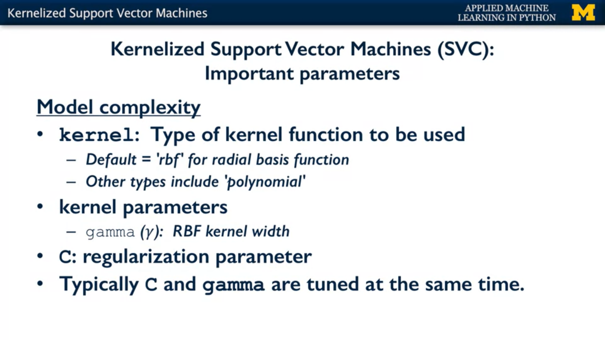

# Introduction to Supervised Machine Learning

## Overfitting 

    Informally, overfitting typically occurs when we try to fit a complex model with an inadequate amount of training data.
    High variance happens when the model is more focused on capturing the more local variations in the training data 
    rather than trying to find the more global trend that we can see as humans in the data causing Overfitting 

---
## Underfitting

    We underfit, when we have a model that's too simple, doesn't even do well on the training data
    and thus, is not at all likely to generalize well to test data.
    A very simple model that maybe only looked at one feature for example.

---
## Goodfitting 
#### Good fit in binary classification

    A good fit classification model is aware of this sort of global pattern of having most
    of the negative points in the upper left and most of the positive points more toward the lower right.

#### Good fit in regression: 

    The better fitting models capture the approximately linear relationship where as x0 increases, y also increases in a linear fashion.
    A good fit regression model is able to fit a line along data points.

---

# 1) The K nearest neighbor

### classifier:

### Regresser: 

    The K nearest neighbor regresser doesn't make a lot of assumptions about the structure of the data,
    and gives potentially accurate but sometimes unstable predictions that are sensitive to small changes in the training data.
  

> Performance is measuared by R-squared value between 0 and 1.
> A value of 1 corresponds to the best possible performance, 
> A value of 0 corresponds to a model that makes a constant value prediction that's always just a mean value of all the training target values.

### Underfiting, good fitting anf Overfitting  

    The effect of reducing K in the k-nearest neighbors classifier is to increase the variance of the decision boundaries, 
    because the decision boundary can be affected by outliers. The general idea is that as we decrease K for k-NN classifiers, 
    we increase the risk of overfitting.

> Now, the actual value of k that works best can only be determined by evaluating on a test set.
> KNN is slow when working with large datasets, and high dimenional datasets.
> If we increase the k value to something very big like 55 the model starts to underfit.

---
# 2) Linear Regression (least-square):

- In a linear regression model, there may be multiple features, denoted as x0, x1, etc..

- The predicted output, which we denote ***y hat***, is a weighted sum of features plus a constant term ***b hat***.

- The ***w hat*** and ***b hat*** values which we call the train parameters or coefficients are estimated from training data.
 
- And ***y hat*** is estimated from the linear function of input feature values and the train parameters. 

- The amount of regularisation to apply is controlled by the alpha parameter. Larger alpha means more regularization 
  and simpler linear models with weights closer to zero. The default setting for alpha is 1.0.

- W0 corresponds to the slope of the line and b corresponds to the y intercept of the line.

### Least-squared 
    
    The technique of least-squares, is designed to find the slope, the w value, and the b value of the y intercept,
    that minimize the total squared error for all the training points (sum of the squared values of the differences)

##### Least-squares is based on the squared loss function:

###### There are another ways to estimate w and b parameters for a linear model, called Ridge and lasso Regression.

---
# 3) Ridge Regression (L2 Regularisation):

##### Regularization: is a way to prevent overfitting, and thus, improve the likely generalization performance of a model, by restricting the models possible parameter settings.

    Ridge regression is regularizing the linear regression by imposing that sum of squares penalty on the size of the W coefficients.
    During the training phase, it adds a penalty for feature weights values that are too large (Wj in the equation below). 
    In the other words, L2 penalty is a sum of squares of all the coefficients.

    If ridge regression finds two possible linear models that predict the training data values equally well,
    it will prefer the linear model that has a smaller overall sum of squared feature weights.

#### as shown in the equation here:

---
# 4) Lasso Regression (L1 Regularisation ) :

    The L1 penalty looks kind of similar to the L2 penalty, in that it computes a sum over the coefficients 
    but it's some of the absolute values of the W-coefficients instead of a sum of squares.

    With lasso regression, a subset of the coefficients are forced to be precisely zero. Which is a kind of automatic feature selection, 
    since with the weight of zero the features are essentially ignored completely in the model.

---

# 5) Linear Classifiers: Logistic Regression

    The logistic regression model still computes a weighted sum of the input features xi and the intercept term b,
    but it runs this result through a special non-linear function f, the logistic function

    It's an S shaped function that gets closer and closer to 1 as the input value increases above 0 
    and closer and closer to 0 as the input value decreases far below 0.

    The effect of applying the logistic function is to compress the output of the linear function 
    so that it's limited to a range between 0 (negative class) and 1 (positive class).

    Any data instances whose logistic probability estimate y hat is greater than or equal 
    to 0.5 are predicted to be in the positive class, otherwise, in the other red class.

---

# 6) Linear Classifiers: Linear Support Vector Machines (LSVM)

     Instead of predicting a continuous target value, we take the output of the linear function and apply
     the sine function to produce a binary output with two possible values, corresponding to the two possible class labels.

     If the target value is greater than zero, the function returns (+1), and if it's less than zero, the function returns (-1).

### Class margin
    
    The margin is the distance the width that we can go from the decision boundary perpendicular to the nearest data point.
    The margin quantifies the degree to which the classifier can split the classes into two separate regions.
    
    We can define the best classifier as the classifier that has the maximum amount of margin
    This maximum margin classifier is called the Linear Support Vector Machine, 
    also known as an LSVM or a support vector machine with linear kernel.

> Linear support vector machines workes well for simpler kinds of classification problems, where the classes were linearly separable or close to linearly separable

#### Example on LSVM

---

# Multi-Class Classification with Linear models:

#### how do we deal with this multiclass classification situation with scikit-learn? 

    When you pass in a dataset that has a categorical target variable, scikit-learn detects this automatically 
    and then for each class to be predicted. Scikit-learn creates one binary classifier that predicts that class 
    against all the other classes. It converts a multiclass classification problem into a series of binary problems. 

> We use `LinearSVC` class for Multi-Class Linear Support Vector Machines

---

# 7) Kernelized Support Vector Machines (SVMs)

    The kernel function in an SVM tells us, given two points in the original input space,
    what is their similarity in the new feature space?
    (I.E. transfer the original feature space into new feature space)

    So, the kernelized support vector machine tries to find the decision boundary with maximum margin 
    between classes using a linear classifier in the transformed feature space not the original input space.

    the kernelized SVM can compute very complex decision boundaries just in terms of similarity calculations 
    between pairs of points in the high dimensional space where the transformed feature representation is implicit.
    This similarity function which mathematically is a kind of dot product is the kernel in kernelized SVM.

#### There are three main parameters that control model complexity for kernelized SVMs.

## 1) Radial basis function kernel (RBF):

    For the radial basis function kernel, the similarity between two points and the transformed feature space
    is an exponentially decaying function of the distance between the vectors and the original input space

#### RBF is shown by the formula here:

## 2) Gamma and C

Gamma controls how tightly the decision boundaries end up surrounding points in the input space.

#### Small Gamma

- Small gamma means a larger similarity radius, So that points farther apart are considered similar.
  Which results in more points being group together and broader, smoother decision boundaries.

- If gamma is small, the model is much more constrained and the effective of (C regularization)
  will be similar to how it would affect a linear classifier.

#### Large Gamma

- larger values of gamma, points have to be very close to be considered similar. This results in 
  smaller, more complex and tight decision boundaries. (i.e Sharpening the kernel).

- If gamma is large, then C (regularisation) will have little to no effect.

> By default, the SVM in Sci-kit learn will use the radial base's function, but a number of other choices are supported.

> The most important thing to remember when applying SVMs is that it's important to normalize the input data, so that all the features have comparable units that are on the same scale.

---

# 8) Decision Trees

    Basically, decision trees learn a series of explicit if then rules on feature values 
    that result in a decision that predicts the target value. We can continue to narrow
    down the set of possible answers by asking more and more specific questions.

    The decision tree building algorithm starts by finding the feature that leads to the most informative split.

### Decision Trees Overfitting
    
- **Pre-pruning :**
    - to prevent the tree from becoming really detailed and complex by stopping its growth early.

- **post-pruning or pruning :**
    - Build a complete tree with pure leaves but then to prune back the tree into a simpler form.

> The decision tree implementation and `scikit-learn` only implements **Pre-pruning**

--- 
## Summary of Linear models and Regularisation 

    In general when we talk about training a linear model. We mean estimating values for the parameters of the model,
    or coefficients of the model. In such a way that the resulting predictions for the outcome variable are a good fit to the data. 

    Given possible settings for the model parameters, the learning algorithm predicts the target value for each training example,
    and then computes what is called a loss function for each training example. For example, a squared loss function would return
    the squared difference between the target value and the actual value as the penalty. The learning algorithm then computes or 
    searches for the set of w, b parameters that minimize the total of this loss function over all training points.
    
    
    A simple linear model could not capture this nonlinear relationship, but by adding nonlinear features like polynomials 
    to the linear regression model, we can capture this nonlinearity. these are called nonlinear basis functions for regression.

> In general, regularisation works especially well when you have relatively small amounts of training data compared to the number of features in your model.

> regularisation becomes less important as the amount of training data you have increases.

> In general, lasso regression is most helpful if you think there are only a few variables that have a medium or large effect on the output variable
> Otherwise if there are lots of variables that contribute small or medium effects, ridge regression is typically the better choice.

> If all  features are not on the same scale or unit, we should do feature scaling before doing regularisation,
> to ensure that there is no feature will have more weight than the otehr.

#### Note that for both Support Vector machines and Logistic Regression, higher values of C correspond to less regularization, Very small values of C use more regularization.
#### A regularization penalty on the model coefficients can also be applied with logistic regression, and is controlled with the ***parameter C*** (L2 is on by default, C=1.0).

- With large values of C:
    - logistic regression tries to fit the training data as well as possible. 
    - LSVM will have smaller decision boundars .

- While with small values of C
    - Logistic Regression tries harder to find model coefficients that are closer to 0, even if that model fits the training data a little bit worse.
    - LSVM classifier is encouraged the to find a large marge on decision boundary, even if that decision boundary leads to more points being misclassified.

---
# Cross-Validation

    Cross-validation basically gives more stable and reliable estimates of how the classifiers likely to perform on average 
    by running multiple different training test splits and then averaging the results, instead of relying entirely 
    on a single particular training set.

## a) Regular K-fold Cross-Validation
    
    For example, to do five-fold cross-validation, the original dataset is partitioned into five parts of equal or close to equal size.
 

## b) Stratified K-fold Cross-validation

    The Stratified Cross-validation means that when splitting the data, the proportions of classes in each fold
    are made as close as possible to the actual proportions of the classes in the overall data set as shown here.

> For regression, scikit-learn uses regular k-fold cross-validation since the concept of preserving class proportions isn't something that's really relevant for everyday regression problems.

## c) Leave-one-out cross-validation

    "Leave-one-out cross-validation", which is just k-fold cross-validation, with K sets to the number of data samples in the data set. 
    In other words, each fold consists of a single sample as the test set and the rest of the data as the training set.

    Of course this uses even more computation, but for small data sets in particular, it can provide improved proved estimates 
    because it gives the maximum possible amount of training data to a model, and that may help the performance 
    of the model when the training sets are small.

---

3- What’s new for you ?
-
- **Kernalized SVM**
- **RBF**
- **Linear models**
- **Decision Trees**

---
4- Resources ? 
- 
- [https://stackoverflow.com/questions/35076586/when-should-one-use-linearsvc-or-svc](https://stackoverflow.com/questions/35076586/when-should-one-use-linearsvc-or-svc)
- [https://homes.cs.washington.edu/~pedrod/papers/cacm12.pdf]
