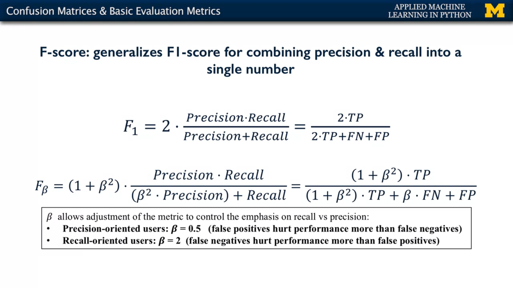
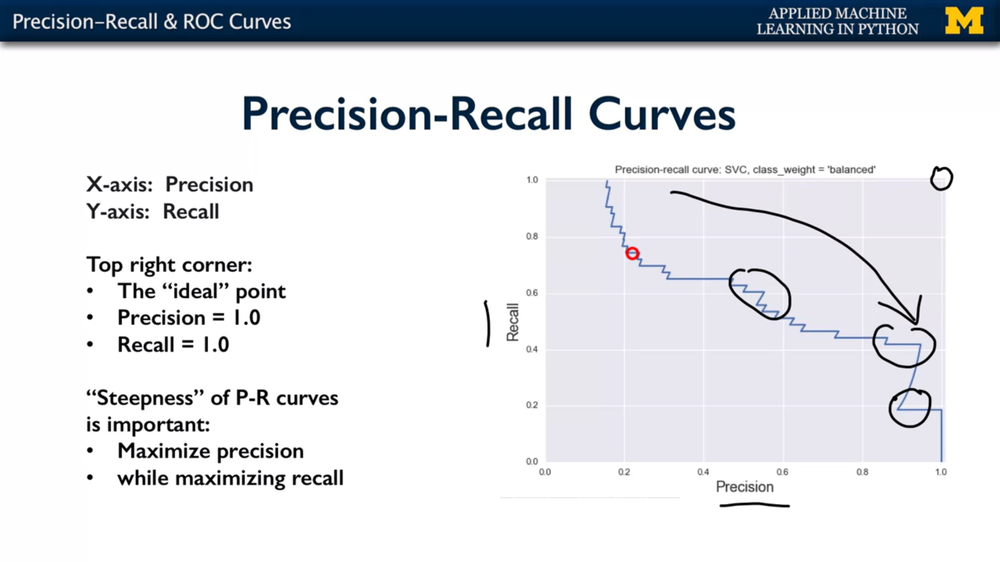
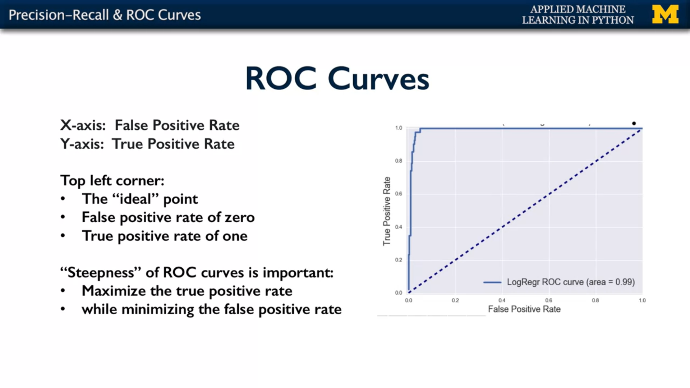
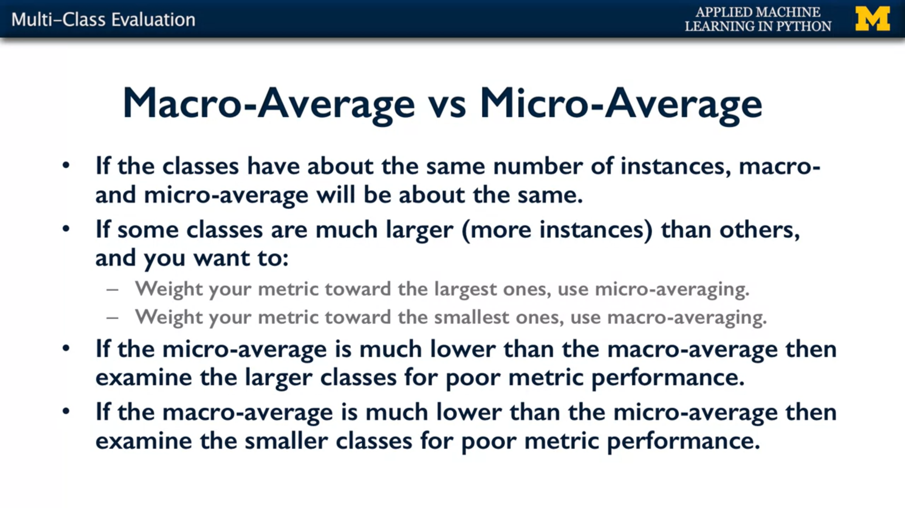

# Model Evaluation & Selection

```
when we have a binary classification task where the most frequent class is the negative class.
Turns out that using the most frequent strategy will never predict the positive class.
And will never be able to count the number of positive instances that are correctly predicted.
```

## Dummy classifiers

   DummyClassifier is a classifier that makes predictions using simple rules, which can be useful 
   as a baseline for comparison against actual classifiers, especially with imbalanced classes.

   Dummy classifiers, are called that because they don't even look at the data to make a prediction,
   They simply use the strategy or rule of thumb that you instruct them to use, when creating them.

#### In general, for imbalanced classification problems, you should use metrics other than accuracy.

---

# Confusion Matrices & Basic Evaluation Metrics

## Confusion Matrices 

#### confusion matrix can give us more information about the types of errors a classifier makes.
- Type I error ( false positive)
- Type II error (false negative)


## 1) Accuracy

    Accuracy is an evaluation metric that allows you to measure the total number of predictions a model gets right.
    Accuracy will answer the question, what percent of the models predictions were correct?
    Accuracy looks at True Positives and True Negatives only.

## 2) Precision

    Precision is a measure that tells you how often that something 
    you label as positive is actually positive?

    Precision is a good measure to determine, when the costs of False Positive is very high. 
    and the cost of a false negative is low. For instance, email spam detection. 


## 3) Recall (True positive rate or Sensitivity)
    
    Is the probability that an actual positive will test positive.
    
    Recall is the measure that tells you the percentage of positives the model has labeled correctly.

    Recall is the metric we use to select our best model when there is a high cost associated with False Negative.
    For instance, in fraud detection or sick patient detection.

## 4) False positive Rate (FPR)

    It’s the probability that a false alarm will be raised: that a positive result will be given
    when the true value is negative. This gives the fraction of all negative instances that the 
    classifier incorrectly identifies as positive.
    It is calculated as FP/TN+FP.


## 5) The specificity (True Negative Rate):

    The true negative rate (also called specificity), is the probability that an actual negative will test negative.
    It is calculated as TN/TN+FP.


## 6) F1-score

    F1 is a function of Precision and Recall. F1 Score might be a better measure to use if we need to seek a balance 
    between Precision and Recall AND there is an uneven class distribution (large number of Actual Negatives).




---
# Classifier Decision Functions

Many classifiers in scikit learn can provide information about the uncertainty associated with a particular prediction 
either by using the `decision_function` method or the `predict_proba` method.
   
    When given a set of test points, the decision function method provides for each one
    a classifier score value that indicates how confidently classifier predicts the positive class

    Likewise, the predict proba function provides predicted probabilities of class membership.


---

## Precision-recall

    And in general, with precision recall curves, the closer the curve is to the top right corner,
    the more preferable it is, the more beneficial the tradeoff it gives between precision and recall.




## ROC curves

    ROC (receiver operating characteristic curves) is a the single number that measures the 
    total area underneath the ROC curve as a way to summarize a classifier's performance.



- The ideal point in ROC space is one where the classifier achieves a **false positive rate of zero**, and a **true positive rate of one**.
So that would be the **upper left corner**. 

- The dotted line here is used as a base line.


- So the area underneath the random classifier is going to be 0.5 


- but then the area underneath the curve will get larger and larger as it approaches the top left corner (1).


- So, an AUC of zero represents a very bad classifier, and an AUC of one will represent an optimal classifier.


---
# Multi-Class Evaluation




## 1) Macro-average Method:

- **Steps:**
    - Compute precision and recall within each class.
    - Take the average of the precision and recall to produce our final **Macro-average precision**
      and **Macro-average recall**.

- The **Macro-average F-Score** will be simply the harmonic mean of these two figures.

> All class contributes equally to the overall macro-average, regardless of how often they appear in the dataset.

> Macro-precision will be low for models that only perform well on the common classes 
> while performing poorly on the rare classes.


## 2) Micro-average Method:

    Micro-averaging will put more emphasis on the common classes in the data set.
    This may be the preferred behavior for multi-label classification problems.

    It is performed by first calculating the sum of all (true positives), (false positives) and
    (false negatives), over all the classes. Then we compute the precision and recall for the sums.


> - The effect of micro-average precision is to give classes with a lot more instances much more influence.

> - Micro-precision values can be high even if the model is performing very poorly on a rare class since it gives more weight to the common classes.
---

# Regression Evaluation

    To check for error where the regression model's predicted value was much larger than the target value.
    Compared to a second error type, where the predicted value was much smaller than the target value.

    In practice though it turns out that for most applications of regression, distinguishing
    between these types of different errors is not as important. 

    In most cases, the default r squared score It's adequate for most tasks.


## 1) Mean absolute error  (L1 norm)

    It takes the mean absolute difference between the target and predicted values.
  
## 2) Mean squared error (L2 norm loss)
   
    It takes the mean squared difference between the target and predicted values.
    larger errors have correspondingly larger squared contributions to the mean error.
    Like mean absolute error, mean squared error doesn't distinguish between over and under estimates.

## 3) Median absolute error

    When ignoring outlier is important, you can use the Median _absolute_error score, 
    which is robust with the presence of outliers because it uses the median of 
    the error distribution rather than the mean.

---

# Optimizing Classifiers for Different Evaluation Metrics


---
3- What’s new for you ?
-


---
4- Resources ? 
-
- [https://medium.com/@erika.dauria/accuracy-recall-precision-80a5b6cbd28d](https://medium.com/@erika.dauria/accuracy-recall-precision-80a5b6cbd28d)
- [https://towardsdatascience.com/accuracy-precision-recall-or-f1-331fb37c5cb9](https://towardsdatascience.com/accuracy-precision-recall-or-f1-331fb37c5cb9)
- [https://www.split.io/glossary/false-positive-rate/](https://www.split.io/glossary/false-positive-rate/)
- [https://tomaxent.com/2018/04/27/Micro-and-Macro-average-of-Precision-Recall-and-F-Score/](https://tomaxent.com/2018/04/27/Micro-and-Macro-average-of-Precision-Recall-and-F-Score/)
- [https://peltarion.com/knowledge-center/documentation/evaluation-view/classification-loss-metrics/micro-recall](https://peltarion.com/knowledge-center/documentation/evaluation-view/classification-loss-metrics/micro-recall)
