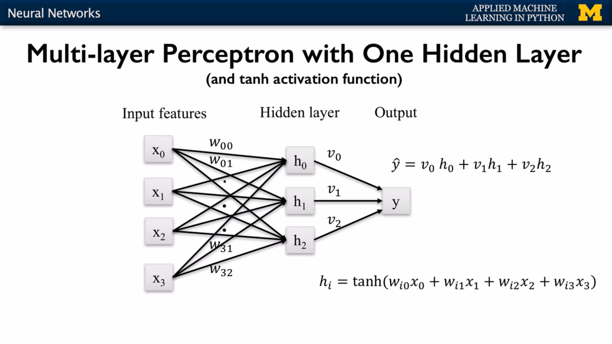

# Supervised Machine Learning

## 1) Naive Bayes Classifiers

### 1) Gaussian Naive Bayes classifiers

    Gaussian Naive Bayes Classifier assumes that the data for each class was generated by a simple class specific Gaussian distribution.
    The Gaussian Naive Bayes Classifier estimates for each feature the mean and standard deviation of the feature value for each class.
    
    For prediction, the classifier compares the features of the example data point to be predicted with the feature statistics
    for each class and selects the class that best matches the data point.

    In general there is a parabolic curve between the classes (class boundry). And in the special case where the variance 
    of these feature is the same for both classes, The decision boundary will be linear.

    Gaussian Naive Bayes is used for high-dimensional data. When each data instance has hundreds, thousands or even more features.

> The Bernoulli and Nultinomial flavors of Naive Bayes are used for text classification and text-mining

---
## 2) Random Forests (an ensemble of trees)

    Random forest creates lots of individual Decision trees on a training set. Each tree gives a probability for each possible 
    target class label then the probabilities for each class are averaged across all the trees**.
    
- **Predctions:**

    - For **Regression tasks** the overall prediction is then typically the mean of the individual tree predictions.
    - For **classification** the overall prediction is the class with the highest probability. 

- Each tree were built from a different random sample of the data called the `bootstrap`.

- A Bootstrap sample of size N is created by just repeatedly picking one of the N dataset rows at random with replacement, 
  that is, allowing for the possibility of picking the same row again at each selection.

- The resulting bootstrap sample has N rows just like the original training set but with possibly some rows from the original dataset missing 
  and others occurring multiple times just due to the nature of the random selection with replacement.

---
## 3) Gradient Boosted Decision Trees

    The key idea of gradient boosted decision trees is that they build a series of trees in nonrandom ways.

    Where each tree is trained, so that it attempts to correct the mistakes of the previous tree in the series,
    to create a model that makes fewer and fewer mistakes as more trees are added.

- Two ways to learn a less complex gradient boosted tree model are:
    - to reduce the `learning_rate`, so that each tree doesn't try as hard to learn a more complex model, that fixes the mistakes of its predecessor.
    - to reduce the `max_depth` parameter for the individual trees in the ensemble.

> - By default, the `learning_rate` parameter is set to **0.1**, 
> - the `n_estimators` parameter giving the number of trees to use is set to **100**, 
> - and the `max_depth` is set to **3**.
> - making the learning rates smaller, will require more trees to maintain model complexity.
> - Unlike random forest, increasing an `n_estimators` can lead to overfeeding.

---
## 4) MLP (Neural Network)

    MLP is a simple neural network for regression, called a multi-layer perceptron.
    These are also known as feed-forward neural networks.

- **Solver** is the algorithm that actually does the numerical work of finding the optimal weights.
    - The default solver, `adam`, tends to be both efficient and effective on large data sets, with thousands of training examples.
    - For small data sets, the `lbfgs` solver tends to be faster, and find more effective weights.

>  Loss is an evaluation metric that is related to the number of errors made for each example on the training or test set - so lower loss numbers are better. 
---
# Data Leakage

     The term data leakage, describes the situation where the data you're using to train the machine learning algorithm 
     happens to include unexpected extra information about the very thing you're trying to predict
     that would not legitimately be available in actual use, is included in the training data.

- **Example:**
    - If we included the true label of a data instance as a feature in the model.
    - Having test data accidentally included in the training data which leads to overfitting.
    - Same patient ID being in both train and test data.

- **Detecting Data Leakage:**

------

# Resources ? 
-
- [https://heartbeat.fritz.ai/hands-on-with-feature-selection-techniques-filter-methods-f248e0436ce5](https://heartbeat.fritz.ai/hands-on-with-feature-selection-techniques-filter-methods-f248e0436ce5)
- [https://medium.com/@colin.fraser/the-treachery-of-leakage-56a2d7c4e931](https://medium.com/@colin.fraser/the-treachery-of-leakage-56a2d7c4e931)
- [https://www.kaggle.com/c/the-icml-2013-whale-challenge-right-whale-redux/discussion/4865#25839#post25839](https://www.kaggle.com/c/the-icml-2013-whale-challenge-right-whale-redux/discussion/4865#25839#post25839)
- [https://techcrunch.com/2017/04/13/neural-networks-made-easy/](https://techcrunch.com/2017/04/13/neural-networks-made-easy/)
- [https://developer.nvidia.com/blog/deep-learning-nutshell-core-concepts/](https://developer.nvidia.com/blog/deep-learning-nutshell-core-concepts/)
- [https://ai.googleblog.com/2017/03/assisting-pathologists-in-detecting.html](https://ai.googleblog.com/2017/03/assisting-pathologists-in-detecting.html)
- [https://stackoverflow.com/questions/48414212/how-to-calculate-accuracy-from-decision-trees](
https://stackoverflow.com/questions/48414212/how-to-calculate-accuracy-from-decision-trees)